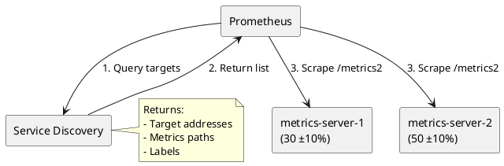

# Prometheus Service Discovery with Dynamic Metrics

This guide explains how to deploy a Prometheus service discovery setup with dynamic metrics generation in Kubernetes.

## Features

- Two metrics servers generating sine wave variations:
  - Server 1: Base value 30 with ±10% variation
  - Server 2: Base value 50 with ±10% variation
- 1-minute period for sine wave
- Automatic service discovery
- Prometheus integration with proper path handling

## Prerequisites

- A running Kubernetes cluster
- kubectl configured to access your cluster
- Prometheus Operator installed in your cluster

## Deployment

Deploy all components using the provided manifest:

```bash
kubectl apply -f k8s-manifests.yaml
```

This creates:
- Two metrics servers with sine wave variation
  - metrics-server-1: Base value 30 (±10%)
  - metrics-server-2: Base value 50 (±10%)
- Service discovery deployment (promdiscovery)
- Required ConfigMaps and Services

## Prometheus Configuration

Update your Prometheus configuration using the provided values file:

```yaml
# myprom.yaml
prometheus:
  prometheusSpec:
    scrapeInterval: 5s  # Frequent scraping for smooth sine wave
    additionalScrapeConfigs:
      - job_name: 'metrics-servers'
        http_sd_configs:
          - url: 'http://promdiscovery.default.svc:80/targets'
            refresh_interval: 10s
        metrics_path: /metrics2  # Default metrics path
        relabel_configs:
          - source_labels: [metrics_path]
            regex: '(.+)'
            target_label: __metrics_path__
            action: replace
          - source_labels: [__meta_http_sd_label_kubernetes_namespace]
            target_label: kubernetes_namespace
          - source_labels: [__address__]
            target_label: instance
```

Apply the configuration:

```bash
# Replace 'prometheus' with your release name if different
helm upgrade prometheus prometheus-community/kube-prometheus-stack -n monitoring -f myprom.yaml
```

## Verification

1. Check if all pods are running:
```bash
kubectl get pods -l 'app in (metrics-server,promdiscovery)'
```

2. Verify metrics endpoints:
```bash
# Check metrics-server-1 (should return ~30 ±10%)
kubectl run curl-test-1 --rm -i --tty --restart=Never --image=curlimages/curl -- \
  curl -s http://metrics-server-1.default.svc.cluster.local/metrics2

# Check metrics-server-2 (should return ~50 ±10%)
kubectl run curl-test-2 --rm -i --tty --restart=Never --image=curlimages/curl -- \
  curl -s http://metrics-server-2.default.svc.cluster.local/metrics2
```

3. Check service discovery:
```bash
kubectl exec -it $(kubectl get pod -l app=promdiscovery -o jsonpath='{.items[0].metadata.name}') -- \
  curl -s localhost/targets
```

## Architecture

### Component Communication



### Components

1. **Metrics Servers**
   - FastAPI applications generating sine wave metrics
   - Each server varies its metric by ±10% over a 1-minute period
   - Exposed on port 80 at path /metrics2

2. **Service Discovery**
   - FastAPI application providing target discovery for Prometheus
   - Returns list of available metrics servers
   - Handles proper labeling for metrics path

3. **Prometheus**
   - Scrapes metrics every 5s for smooth sine wave visualization
   - Uses HTTP service discovery to find targets
   - Properly handles metrics path through relabeling

## Implementation Details

### Metrics Server Code

The metrics server generates a sine wave variation of its base value over a 1-minute period:
- Server 1: Base value 30 varies between 27-33
- Server 2: Base value 50 varies between 45-55

The sine wave ensures smooth transitions and predictable patterns for testing monitoring systems.


```python
from fastapi import FastAPI
from fastapi.responses import PlainTextResponse
import os
import math
import time

app = FastAPI()

# Get configuration from environment variables
BASE_VALUE = float(os.getenv("METRIC_VALUE", "30"))
METRIC_PATH = os.getenv("METRICS_PATH", "/metrics2")

def get_current_value():
    # Calculate time-based sine variation (1-minute period)
    t = time.time()
    period = 60  # 1-minute period
    # Calculate variation: ±10% of base value using sine wave
    variation = BASE_VALUE * 0.1 * math.sin(2 * math.pi * (t % period) / period)
    return BASE_VALUE + variation

@app.get(METRIC_PATH, response_class=PlainTextResponse)
async def metrics():
    current_value = get_current_value()
    return f"""# HELP my_first_metric Metric with sine wave variation (±10% over 1 min)
# TYPE my_first_metric gauge
my_first_metric {current_value:.2f}"""

@app.get("/health")
async def health_check():
    return {"status": "healthy"}
```

#### Code Explanation

1. **Configuration**
   - `BASE_VALUE`: The center point for the sine wave (30 or 50)
   - `METRIC_PATH`: The endpoint path for metrics (/metrics2)

2. **Sine Wave Generation**
   - Uses `time.time()` for continuous progression
   - 60-second period for one complete wave
   - Variation is ±10% of base value
  

3. **Metrics Endpoint**
   - Returns Prometheus-formatted metric
   - Includes help and type information
   - Value formatted to 2 decimal places

4. **Health Check**
   - Simple endpoint for liveness probe
   - Returns status "healthy"

### Service Discovery Code

The service discovery component provides target information to Prometheus in the required HTTP SD format:

```python
from fastapi import FastAPI
from fastapi.responses import JSONResponse
import os

app = FastAPI()

# Get configuration from environment variables
METRICS_PATH = os.getenv("METRICS_PATH", "/metrics2")
TARGET_NAMESPACE = os.getenv("TARGET_NAMESPACE", "default")
TARGET_SELECTOR = os.getenv("TARGET_SELECTOR", "app=metrics-server")

@app.get("/targets", response_class=JSONResponse)
async def get_targets():
    # Return static targets for demonstration
    # In production, use the Kubernetes API to discover pods
    targets = [
        {
            "targets": [
                "metrics-server-1.default.svc.cluster.local:80",
                "metrics-server-2.default.svc.cluster.local:80",
            ],
            "labels": {
                "metrics_path": METRICS_PATH,
                "kubernetes_namespace": TARGET_NAMESPACE,
            },
        }
    ]
    return targets

@app.get("/health")
async def health_check():
    return {"status": "healthy"}
```

#### Code Explanation

1. **Target Format**
   - Returns targets in Prometheus HTTP SD format
   - Uses service DNS names for reliability
   - Includes port 80 for direct access

2. **Labels**
   - metrics_path: Used by Prometheus relabeling
   - kubernetes_namespace: For target identification
   - Labels are used to configure scraping

3. **Production Use**
   - Replace static targets with Kubernetes API
   - Use label selectors to find pods
   - Add error handling and retries

## Configuration

### Metrics Servers

Environment variables:
- `METRIC_VALUE`: Base value for sine wave (default: "30")
- `METRICS_PATH`: Path where metrics are exposed (default: "/metrics2")

### Service Discovery

Environment variables:
- `METRICS_PATH`: Path where metrics are exposed (default: "/metrics2")
- `TARGET_NAMESPACE`: Namespace to look for targets (default: "default")
- `TARGET_SELECTOR`: Label selector for finding targets (default: "app=metrics-server")

## Cleanup

Remove all components:

```bash
kubectl delete -f k8s-manifests.yaml
```
